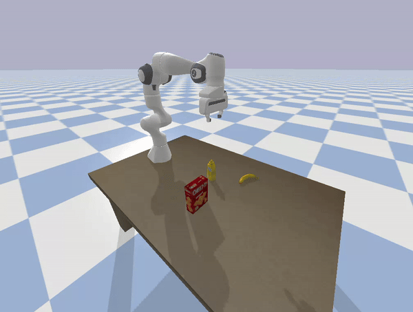

# HW3

Dylan Losey, Virginia Tech.

In this homework assignment we will share autonomy with a robot arm.

## Install and Run

```bash

# Download
git clone https://github.com/vt-hri/HW3.git
cd HW3

# Create and source virtual environment
# If you are using Mac or Conda, modify these two lines as shown in [HW0](https://github.com/vt-hri/HW0)
python3 -m venv venv
source venv/bin/activate

# Install dependencies
# If you are using Mac or Conda, modify this line as shown in [HW0](https://github.com/vt-hri/HW0)
pip install numpy pybullet

# Run the script
python main.py
```

## Expected Output

Use your keyboard to teleoperate the robot.
See `teleop.py` to understand which keys map to which axis of robot motion.


## Assignment

Modify the provided code in `main.py` to complete the following steps:
1. Add a function to predict the human's goal based on their position inputs.
2. Blend the human's teleoperation actions with the robot's assistive actions.
3. Adjust the blending factor `alpha` to find a good balance between assistance and human control. When the human is not pressing any keys, the robot should fully control its own motions.
4. Implement a toggle so that the robot stops/starts providing assistance if the human presses that key.
